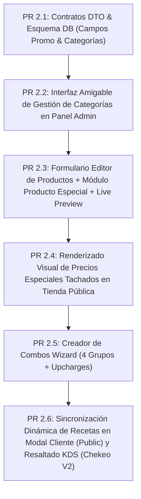

# Plan Maestro Consolidado: Menú, Creador de Combos, Producto Especial y Recetas Sincronizadas — Burgers.exe

Este documento consolida **todas las decisiones comerciales, arquitectónicas y de diseño de interfaz (UI/UX)** acordadas para la evolución del sistema de menú de **Burgers.exe**.

---

## 🎯 Resumen Ejecutivo de Decisiones

1. **Estética & UX**: Estilo **Uber Eats / Premium Casual Vibe** (claro, limpio, sans-serif Inter, tarjetas compactas, cero lenguaje técnico como *SKU, slug, centavos*).
2. **Cero Reacomodos Estructurales**:
   - `Public Order V2` conserva su `DynamicRenderer`, carrusel de banners, píldoras sticky de categorías y `CatalogCartBar`.
   - `Internal Chekeo V2` conserva intactas sus 3 pestañas operativas (`PEDIDOS`, `COCINA`, `PAGOS`).
3. **Sincronización 100% de Recetas (Single Source of Truth)**:
   - Los ingredientes reales de cada hamburguesa en la BD (`ingredients_v2` / `product_ingredient_recipes_v2`) alimentan dinámicamente el modal del cliente y se reflejan directamente en la pantalla de cocina KDS (`❌ Sin Pepinillos` en rojo, `➕ Extra Tocino` en verde).
4. **Creador de Combos de 4 Grupos Flexibles**:
   - Reutiliza productos existentes, aplica precio promocional bundle (`$99 MXN`), soporta hasta 4 grupos obligatorios u opcionales, y permite **upcharges/sobreprecios variables por ítem en cada combo**.
5. **Módulo de Producto Especial (Promoción Temporal)**:
   - Acordeón no invasivo en el editor de producto (`⚡ Descuento o Lanzamiento`). Muestra el precio regular tachado (`<s>$105</s> $75 MXN`) y el badge destacado.

---

## 📐 Diseño Visual de las Interfaces (UI Walkthrough)

### A. Tienda Pública (`Public Order V2`):
```
┌──────────────────────────────────────────────────────────────────────────┐
│  🍔 Burgers.exe                     🎟️ Tickets  ☀️/🌙 Tema               │
├──────────────────────────────────────────────────────────────────────────┤
│  🏢 Entrega hoy en: [ Torre GGA (Disponible) ] [ Torre Valcob ]          │
├──────────────────────────────────────────────────────────────────────────┤
│  [ 🔥 BANNERS PROMOCIONALES / OVERCLOCK 2X1 / BUNDLE GAMER ] (Carrusel)  │
├──────────────────────────────────────────────────────────────────────────┤
│  Píldoras Sticky: [ 📖 Todo ] [ 🍔 Burgers ] [ 🔥 Combos ] [ 🍟 Guarniciones ]  │
└──────────────────────────────────────────────────────────────────────────┘
```

#### Grilla del Catálogo:
- **Tarjeta de Producto**: Foto HD, badge flotante (ej. `⚡ PRECIO ESPECIAL`), precio tachado (`<s>$105.00</s> $75.00 MXN`) o badge de combo (`Ahorras $45 MXN`), y botón grande **`[ ➕ Agregar ]`**.

#### Drawer de Personalización de Hamburguesa:
- **🥬 Ingredientes Incluidos (Removibles)**: Checkboxes con los ingredientes reales de la receta (`✓ Carne`, `✓ Tocino`, `❌ Sin Pepinillos`).
- **➕ Extras Globale (Upgrades)**: Adicionales pagados (`+ Extra Tocino +$5.00 MXN`, `+ Extra Carne +$25.00 MXN`).

#### Drawer de Selección de Combo (4 Pasos):
- **Paso 1**: Hamburguesa principal (con opción de personalizarla).
- **Paso 2**: Guarnición (Papas OG +$0 / Aros de Cebolla +$10).
- **Paso 3**: Bebida (Coca-Cola, Zero, Agua).
- **Paso 4**: Postre / Extra opcional.

---

### B. Panel de Control de Cocina y Operación (`Internal Chekeo V2`):
- **Pestaña `COCINA` (KDS)**:
  - Tarjetas de comanda con **Remociones en rojo destacado** (`❌ Sin Pepinillos`) y **Extras en verde destacado** (`➕ Extra Tocino`).
  - Bloque de empaque con guarnición y bebida seleccionadas en combo.
- **Pestaña `PAGOS` (Caja & WhatsApp)**:
  - Desglose transparente del precio base + extras para que la plantilla de cobro por WhatsApp coincida al centavo.

---

### C. Editor Administrativo de Productos (Con Live Preview):
```
┌─────────────────────────────────────────┬──────────────────────────────────────────┐
│  Formulario de Edición (Amigable)       │  👁️ Live Preview (Vista Previa Cliente)  │
├─────────────────────────────────────────┼──────────────────────────────────────────┤
│ Nombre del producto: [ Burger BBQ     ] │  ┌────────────────────────────────────┐  │
│ Precio público ($): [ 105.00         ]  │  │ ⚡ PRECIO ESPECIAL                  │  │
│ Categoría: [ 🍔 Burgers             ]  │  │ 🖼️ [Imagen del Producto]            │  │
│                                         │  │ Burger BBQ                         │  │
│ ⚡ Oferta Especial (Activado)          │  │ <s>$105.00 MXN</s> $85.00 MXN       │  │
│ Precio oferta ($): [ 85.00           ]  │  │ [ ➕ Agregar al pedido ]            │  │
│ Etiqueta: [ Lanzamiento              ]  │  └────────────────────────────────────┘  │
└─────────────────────────────────────────┴──────────────────────────────────────────┘
```

---

## 🧱 Modelo de Datos Consolidado (`packages/config/src/contracts.ts`)

```typescript
export type MenuItem = {
  sku: string;                // Código único del producto (ej. 'BRG-OG')
  category: string;           // Key de la categoría (ej. 'burgers')
  name: string;
  description?: string;
  price: number;              // Precio regular en pesos (ej. 85.00)
  
  // Módulo de Producto Especial (Promoción)
  promoPrice?: number;        // Precio especial promocional (ej. 75.00)
  promoLabel?: string;        // ej. "Lanzamiento", "Precio Especial"
  isPromoActive?: boolean;    // Switch para encender/apagar promo
  promoExpiresAt?: string;

  // Inventario y Visibilidad
  isAvailable: boolean;
  stockManaged?: boolean;
  stockRemaining?: number;
  
  // Categoría & Orden
  sortOrder: number;
  imageUrl?: string;
  imageKey?: string;
};

// Creador de Combos con 4 Grupos y Upcharges Variables
export type ComboItemOption = {
  sku: string;               // SKU del ítem existente
  isDefault?: boolean;       // Si viene incluido por defecto ($0)
  upchargeCents: number;     // Sobreprecio específico en ESTE combo (ej. 500 = +$5 MXN)
};

export type ComboOptionGroup = {
  id: string;
  name: string;              // ej. "1. Elige tu plato principal"
  isRequired: boolean;       // Obligatorio u Opcional
  minSelections: number;
  maxSelections: number;
  options: ComboItemOption[];
};

export type MenuItemComboConfig = {
  isCombo: boolean;
  bundlePriceCents: number;  // Precio promocional del bundle (ej. $99.00 MXN)
  optionGroups: [
    ComboOptionGroup?,       // Grupo 1 (Principal)
    ComboOptionGroup?,       // Grupo 2 (Guarnición)
    ComboOptionGroup?,       // Grupo 3 (Bebida)
    ComboOptionGroup?        // Grupo 4 (Postre/Extra)
  ];
};
```

---

## 📋 Inventario Actual del Catálogo por Categorías (Base Producción D1)

| Categoría | SKU | Nombre | Precio Base | Detalles de Receta / Configuración |
|---|---|---|---|---|
| 🍔 **Burgers** | `BRG-OG` | **Burger OG** | $85.00 MXN | Carne smash, Tocino, Queso americano, Queso manchego, Jitomate, Lechuga, Pepinillos, Catsup, Mostaza, Mayonesa |
| 🍔 **Burgers** | `BRG-BBQ` | **Burger BBQ** | $85.00 MXN | Carne smash, Tocino, Queso americano, Queso manchego, Aros de cebolla, Pepinillos, Salsa BBQ |
| 🔥 **Combos** | `COMBO-OG` | **Combo OG** | $99.00 MXN | Burger OG + Guarnición (Fija o A elegir) + Bebida (Bundle $99) |
| 🔥 **Combos** | `COMBO-BBQ` | **Combo BBQ** | $99.00 MXN | Burger BBQ + Guarnición (Fija o A elegir) + Bebida (Bundle $99) |
| 🍟 **Guarniciones** | `PAPAS_OG` | **Papas OG** | $20.00 MXN | Guarnición estándar ($0 extra en combo) |
| 🍟 **Guarniciones** | `PAPAS_ESPECIALES` | **Papas Especiales** | $25.00 MXN | Upgrade (+ $5 extra en combo) |
| 🍟 **Guarniciones** | `PAPAS_LEMON_PEPPER` | **Papas Lemon & Pepper** | $25.00 MXN | Upgrade (+ $5 extra en combo) |
| 🍟 **Guarniciones** | `AROS_CEBOLLA` | **Aros de Cebolla** | $30.00 MXN | Upgrade (+ $5 ó $10 extra en combo) |
| ➕ **Extras** | `EXT-BACON` | **Extra Tocino** | +$5.00 MXN | Upgrade global burger |
| ➕ **Extras** | `EXT-CHEESE-AM` | **Extra Queso Americano** | +$5.00 MXN | Upgrade global burger |
| ➕ **Extras** | `EXT-CHEESE-MA` | **Extra Queso Manchego** | +$5.00 MXN | Upgrade global burger |
| ➕ **Extras** | `EXT-PATTY` | **Extra Carne Smash (125g)** | +$25.00 MXN | Upgrade global burger |
| 🥤 **Bebidas** | `DRK-COKE` | **Coca-Cola 355ml** | $39.00 MXN | Incluida en combo ($0 extra) |
| 🥤 **Bebidas** | `DRK-COKE-ZERO` | **Coca-Cola Zero 355ml** | $39.00 MXN | Incluida en combo ($0 extra) |
| 🥤 **Bebidas** | `DRK-WATER` | **Agua Ciel 600ml** | $25.00 MXN | Incluida en combo ($0 extra) |

---

## 🗂️ Roadmap Secuencial de PRs de Implementación



### Detalle de los PRs:
1. **PR 2.1: Contratos DTO & Esquema DB**
   * Extensión de interfaces TypeScript en `@config` y migración D1 local/preview para columnas de promo y categorías.
2. **PR 2.2: Gestor de Categorías**
   * Modal visual con picker de emojis y botones `⬆️ Subir` / `⬇️ Bajar` para reordenar categorías al instante.
3. **PR 2.3: Formulario Editor de Productos + Live Preview**
   * Formulario amigable en lenguaje humano + acordeón de Producto Especial + panel de Vista Previa en Tiempo Real.
4. **PR 2.4: Renderizado de Ofertas en Tienda Pública**
   * Actualización de tarjetas de catálogo en `Public Order V2` para mostrar precios tachados y badges.
5. **PR 2.5: Creador de Combos Wizard**
   * Asistente por pasos para armar combos de 4 grupos con sobreprecios variables por combo.
6. **PR 2.6: Sincronización Dinámica de Recetas & KDS**
   * Modal cliente alimentado por `product_ingredient_recipes_v2` y resaltado de remociones/extras en KDS Cocina Chekeo V2.

---

## 🧪 Plan de Verificación

### Tests Automatizados:
- `npm run typecheck`
- `npm run build:public`
- `npm run build:internal`

### Verificación Manual:
- Pruebas E2E completas desde la creación de una hamburguesa/combo en admin hasta su pedido en la tienda pública y visualización en la pantalla KDS de cocina.
