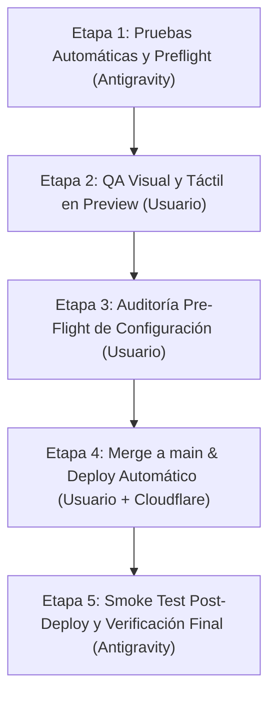

# Plan de Lanzamiento por Etapas (Staged Release Pipeline - Burgers.exe V2)

Este plan formaliza la estrategia de **Lanzamiento por Etapas** para garantizar que ningún código llegue a producción sin haber sido probado automáticamente, auditado visualmente en **Preview** y autorizado explícitamente por el **Usuario**.

---

## 🛑 Las 5 Etapas del Lanzamiento Seguro

---

### 1️⃣ Etapa 1: Pruebas Automáticas y Sanidad de Código (Antigravity)
- **Objetivo**: Garantizar que el código compila limpiamente sin romper nada.
- **Acciones**:
  - `npm run typecheck` (0 errores TypeScript).
  - `npm run build:public` y `npm run build:internal` (compilación limpia).
  - `verify-local-tooling.ps1` y `verify-skills.ps1`.
  - Auditoría D1 read-only en `burgers-exe-menu-live` (`rows_written = 0`).
  - `git diff --check` y sanidad de repositorio.
- **Estado**: ✅ **COMPLETADO Y VALIDADO**.

---

### 2️⃣ Etapa 2: Vista Previa y QA Visual en Preview (Usuario)
- **Objetivo**: Probar la experiencia visual y táctil en un entorno idéntico a producción sin tocar clientes reales.
- **Acciones**:
  - Entorno de Preview aislado:
    - App Pública Preview: `https://burgers-exe-public-v2-preview.pages.dev`
    - Chekeo Interno Preview: `https://burgers-exe-internal-v2-preview.pages.dev`
  - **Prueba del Usuario**:
    - [ ] Abrir el menú público en dispositivo móvil real.
    - [ ] Probar fluidez de banners, productos, categorías y adición al carrito.
    - [ ] Verificar bloqueo de ítems no disponibles (`isAvailable === false`).
    - [ ] Probar flujo de pedido de prueba (pickup/delivery) hasta redirección a WhatsApp.
    - [ ] Abrir Chekeo Interno y verificar Kitchen View / tablero de pedidos.

---

### 3️⃣ Etapa 3: Auditoría Pre-Flight de Configuración en Producción (Usuario)
- **Objetivo**: Confirmar que la infraestructura de Cloudflare tiene todas las variables y secretos listos antes del merge.
- **Acciones en Cloudflare Dashboard**:
  - [ ] Confirmar `ORDERS_V2_WRITE_ENABLED = true` en producción.
  - [ ] Confirmar presencia del secreto `BOG_INTERNAL_PIN` en `chekeo2-0`.
  - [ ] Confirmar bindings `BOG_MENU_DB` ➡️ `burgers-exe-menu-live` y `BOG_MENU_ASSETS` ➡️ `burgers-exe-assets-v2`.

---

### 4️⃣ Etapa 4: Merge Autorizado & Despliegue Automático por Git (Usuario)
- **Objetivo**: Promover los cambios a producción mediante la integración de Git.
- **Acciones**:
  - Antigravity asegura el PR listo y verificado.
  - **El Usuario autoriza verbalmente en el chat y presiona "Merge Pull Request" a `main` en GitHub**.
  - Cloudflare Pages detecta el merge y compila/despliega automáticamente a `burgers-exe` y `chekeo2-0`.

---

### 5️⃣ Etapa 5: Smoke Test Post-Deploy y Monitoreo (Antigravity)
- **Objetivo**: Validar inmediatamente que la aplicación en vivo está respondiendo al 100% sin caídas.
- **Acciones**:
  - Antigravity ejecuta el Smoke HTTP en vivo contra producción:
    - `https://burgers-exe.pages.dev/api/menu-v2` ➡️ Validar `200 OK` y `source: "d1"`.
    - `https://chekeo2-0.pages.dev/api/internal-v2-auth/status` ➡️ Validar `200 OK`.
  - Registro final en la bitácora `docs/codex-memory/20-production-launch-readiness.md`.

---

## 🛑 Runbook de Rollback (En caso de falla en Etapa 5)

Si la Etapa 5 detectara algún error de conexión post-merge:
1. En Cloudflare Dashboard ➡️ Pages ➡️ `burgers-exe` / `chekeo2-0` ➡️ **Deployments**.
2. Seleccionar el despliegue previo y hacer clic en **"Rollback to this deployment"**.
3. Cero mutaciones en la base de datos D1 o R2 live durante el rollback.
