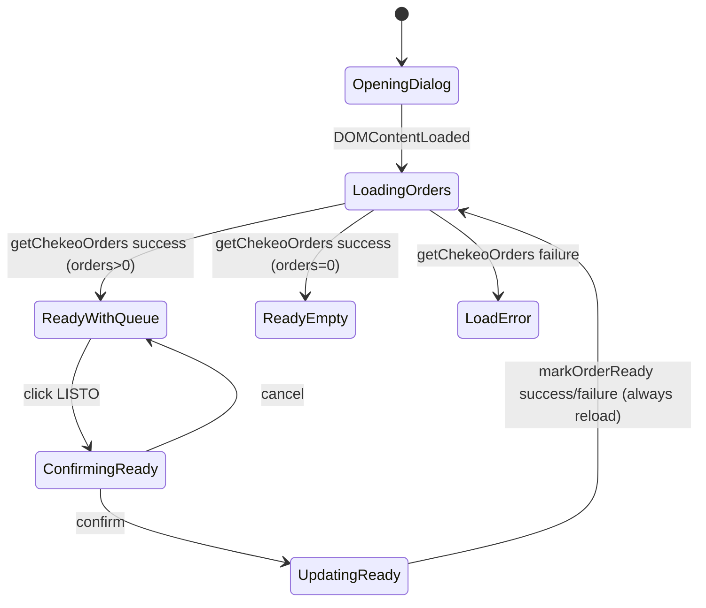

# Fase 0 — Boot flow / startup audit

## C. Flujo actual de arranque (as-is)

## Secuencia observada
1. **App open**: se abre diálogo modeless (`showChekeoApp`).
2. **Inicialización frontend**: `DOMContentLoaded` → `loadOrders()`.
3. **Carga remota**: llamada a `getChekeoOrders()`.
4. **Filtrado backend**: solo estados activos, sort por `masterRow`.
5. **Hydratación local mínima**: `state.orders`, `state.current`, reset `pendingOrderId`.
6. **Render inicial**: cola activa o estado vacío.

## Cobertura actual de etapas pedidas
- Validación de sesión: **No implementada**.
- PIN: **No implementado**.
- Chequeo de versión/update: **No implementado**.
- Conectividad: **No modelada explícitamente** (solo failure handler genérico).
- Hidratación de estado: **Parcial** (solo cola en memoria UI).
- Carga de pantalla inicial: **Sí** (vista principal única).

## Estado/transición actual (simplificado)

## Riesgos específicos detectados

### 1) Riesgo de loops
- **Loop de recarga tras error operativo**: en `confirmReady`, tanto success como failure llaman `loadOrders()`. Si backend falla de forma persistente, UI entra en patrón repetitivo de reintentos manuales (no infinito automático, pero sí “loop operacional” de usuario).
- **No hay loop de sesión/PIN** hoy porque no existen esas capas; riesgo aparecerá en migración si no se diseña FSM explícita.

### 2) Rehidratación inconsistente
- Estado local se reconstruye completo en cada carga, pero no hay checksum/versionado de snapshot.
- `normalizeKitchenStatus_` cae a `PENDIENTE` por defecto ante valor no reconocido; potencialmente “rehidrata” datos inválidos como activos.

### 3) Update no detectado
- No existe módulo ni política de versionamiento de app cliente.
- No hay “minimum supported version” ni invalidación de cliente.

### 4) Persistencia de estado viejo en móvil
- Frontend usa memoria temporal, pero en contenedor modeless puede haber instancias abiertas en paralelo.
- `syncChekeoFromMaster` preserva estado por ID; si cambia estructura origen, puede arrastrar estados antiguos no revisados.

### 5) Acoplamientos peligrosos
- UI dispara operaciones backend directamente (`google.script.run`) sin capa de casos de uso.
- Sync, estado de cocina y representación de pedido se resuelven en un servicio monolítico (`Code.gs`).
- Errores remotos se reducen a toast genérico en capa visual.

## Controles propuestos para evitar futuros loops
1. **FSM de boot obligatoria** con estados terminales mutuamente excluyentes (`NeedsUpdate`, `NeedsAuth`, `NeedsPin`, `Offline`, `Ready`, `Fatal`).
2. **Guard de transición**: un evento no puede reentrar al mismo estado más de N veces sin backoff.
3. **Idempotency key** para acciones críticas (`markReady`) + dedupe de requests en cliente.
4. **Canal de diagnóstico estructurado** (event log interno) separado de la UI.

