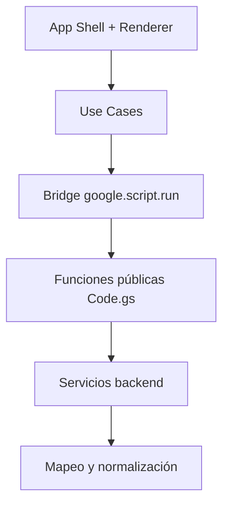

# Fase 0/1 — Arquitectura objetivo pragmática para Burger-OG

## Principio rector
Separar claramente:
1. estado y render de UI,
2. casos de uso de pantalla,
3. bridge remoto (`google.script.run`),
4. servicios backend de dominio,
5. mapeo/normalización de datos.

## Capas objetivo (actuales)

### 1) App Shell UI
- Inicializa app, wiring de eventos y ciclo de vida de pantalla.
- Mantiene estado de UI y decide qué renderizar (cola/empty/confirm).

### 2) Frontend Use Cases
- Acciones de negocio de pantalla (`loadOrders`, `openConfirm`, `confirmReady`).
- Sin templates largos ni llamadas remotas directas dentro del HTML estático.

### 3) Apps Script Bridge
- Wrapper único para `google.script.run`.
- Punto de control para errores remotos y contrato de datos.

### 4) Backend Services
- `sync`: sincronización Master→Chekeo.
- `orders`: lectura de cola activa.
- `status`: transición a LISTO con lock/timestamps.
- `diagnostics`: chequeos operativos.

### 5) Data Mapping / Normalization
- Mapeo de columnas a DTO de orden.
- Normalización de estado, cantidades, fechas y banderas Sí/No.
- Utilidades compartidas sin mezclar con flujo UI.

## Flujo

## Beneficios sobre estado actual
- Menos acoplamiento render/IO.
- Backend dividido por responsabilidad sin romper compatibilidad.
- Base lista para reinterpretación visual incremental.

## Extensiones futuras (no prioridad de esta fase)
- Session/Auth/PIN.
- Update/version manager.
