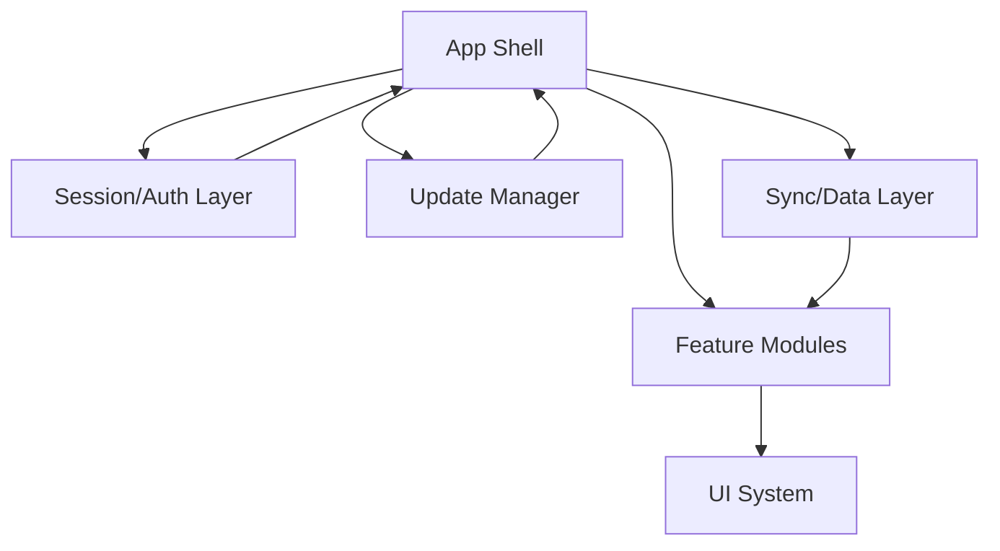

# Fase 0 — Arquitectura objetivo (to-be)

## D. Arquitectura propuesta con límites claros

## Principio rector
Separar decisiones de *arranque y elegibilidad* (sesión, PIN, versión, conectividad, sync) del *render de pantallas*.

## Capas mínimas

### 1) App Shell
**Responsabilidad:** orquestar boot, navegación raíz, estado global de readiness y eventos de ciclo de vida.

- Ejecuta el estado inicial de la app.
- No conoce detalles de negocio de pedidos.
- Consume resultados de Session/Auth, Update y Sync para decidir ruta raíz.

### 2) Session/Auth Layer
**Responsabilidad:** identidad de operador, validez de sesión, expiración, refresh y política de bloqueo.

- Expone `getSessionState()` con estados tipados.
- Gestiona logout seguro y limpieza de caches dependientes.
- Emite eventos (`session.expired`, `session.refreshed`).

### 3) Update Manager
**Responsabilidad:** versionado de cliente, compatibilidad mínima, forzado de update cuando aplique.

- Expone `checkCompatibility()` antes de permitir `Ready`.
- Distingue `update_available` vs `update_required`.
- No toca UI directamente; retorna decisiones al Shell.

### 4) Sync/Data Layer
**Responsabilidad:** ingestión, normalización, validación, persistencia y sincronización de datos de órdenes.

- Adaptadores de origen (Sheets/API) aislados.
- Reglas de merge/preservación de estado operativo centralizadas.
- Contratos de error tipados (`offline`, `timeout`, `schema_mismatch`, etc.).

### 5) Feature Modules
**Responsabilidad:** casos de uso concretos (cola activa, detalle, marcar listo, diagnóstico operativo).

- Cada módulo consume interfaces del Sync/Data layer.
- Sin acceso directo a transporte ni UI framework.
- Estados de vista normalizados: loading/empty/error/success.

### 6) UI System
**Responsabilidad:** componentes, tokens y layouts.

- Presentación desacoplada de side effects.
- Reinterpretación visual premium/HUD solo en áreas útiles (foco operacional).
- Componentes accesibles y reutilizables.

## Flujo entre capas

## Contratos recomendados (mínimos)
- `BootDecision = NeedsUpdate | NeedsAuth | NeedsPin | Offline | Ready | Fatal`
- `SessionState = Valid | Expired | Missing | Locked`
- `SyncState = Idle | Syncing | Fresh | Stale | Failed`
- `FeatureViewState<T> = Loading | Empty | Error(code) | Success(data)`

## Problemas actuales que corrige
1. **Monolito funcional en backend** → separación por servicios y casos de uso.
2. **Boot implícito y lineal** → FSM explícita, auditable y testeable.
3. **Errores genéricos** → taxonomía de errores por dominio.
4. **Acoplamiento render-IO** → UI reactiva a estado, no a llamadas directas.
5. **Riesgo de regresión en sync** → reglas de merge centralizadas con pruebas.

## Mínimos no negociables de diseño
- Ningún módulo de UI llama directamente al transporte remoto.
- Session/Auth, Update y Sync no se importan entre sí de forma circular.
- El Shell decide la pantalla raíz; los módulos solo reportan estado.

